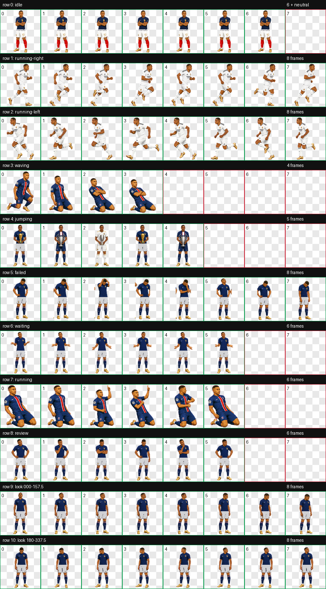

# Trophy Striker V2

Unofficial custom Codex pet for personal, non-commercial use.


## Install

From the repository root:

```bash
mkdir -p ~/.codex/pets
cp -R pets/trophy-striker-v2 ~/.codex/pets/
```

Then restart Codex or open a new Codex window so the pet list refreshes.

## Preview



## Included Files

- `pet.json`
- `spritesheet.webp`
- `preview.gif`
- `contact-sheet.png`
- `look-directions.png`
- `validation.json`
